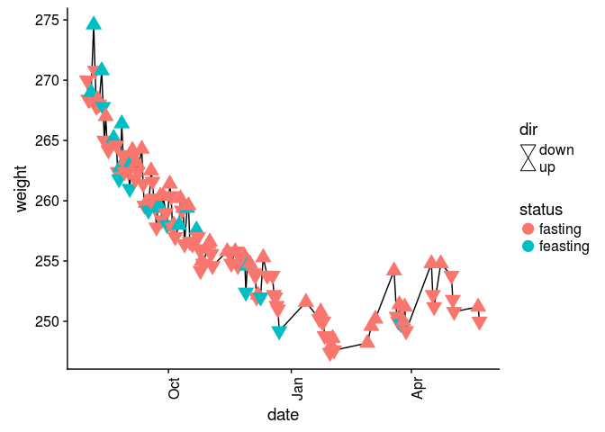

<!-- README.md is generated from README.Rmd. Please edit that file -->
trackWeight
===========

The goal of trackWeight is to help me keep track of my weight fluctuations over time as I pursue weight loss via intermittent fasting. The package has a function to create a range of date values and put `fasting` or `not fasting` depending on the day to be added to a google sheet, and then another function that reads in the filled out google sheet, and generates a figure that is below.

Installation
------------

You can install trackWeight from github with:

``` r
# install.packages("devtools")
devtools::install_github("rmflight/trackWeight")
```

If you want to use this for yourself, you will want to look at [this guide](track_your_own.md)

Track My Weight
---------------

``` r
library(trackWeight)
weight_data <- read_sheet_data(".gs_url")
weight_data$date <- as.POSIXlt(weight_data$date, format = "%Y-%m-%d")
plot_weight(weight_data)
```


